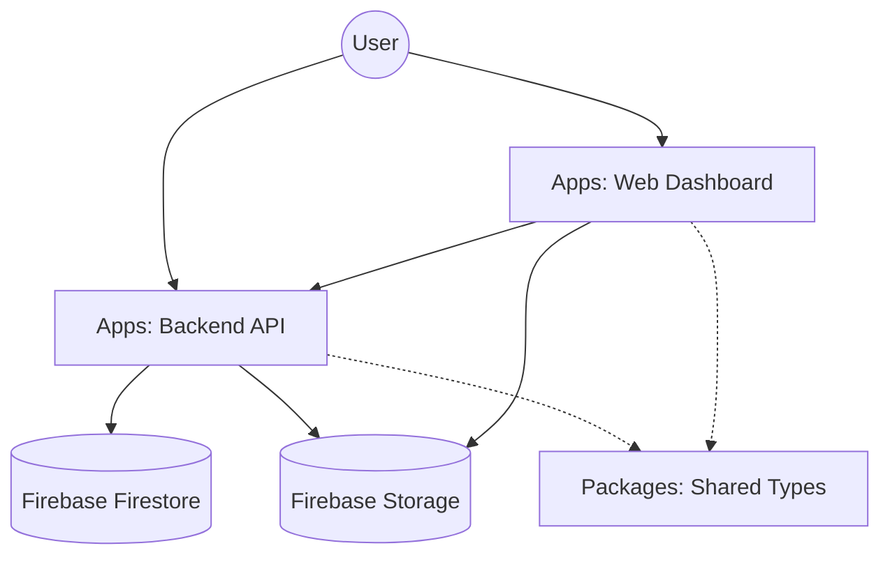

# Construction Scanning Platform

**A high-performance, agentic-ready monorepo for construction site data ingestion, processing, and visualization.**

This project serves as the robust backend infrastructure for an advanced iOS scanning application. It allows users to capture, upload, and manage comprehensive site scans (LiDAR, images, audio) with a scalable, cloud-native architecture.

## 🌟 Why This Project is Different

Unlike traditional scanning backends, this platform is engineered for **velocity** and **developer experience**:
1.  **Monorepo by Design**: Shared contracts (`@construction/shared`) ensure the Backend and future web/processing services always speak the same language.
2.  **Source-Based Deployment**: We utilize `tsx` to run TypeScript directly in production on Cloud Run. This eliminates complex build pipelines and associated artifact drift, ensuring what you develop is exactly what runs.
3.  **Mock-First Development**: Integrated `MOCK_FIREBASE` mode allows full offline development and testing without credentials.
4.  **Direct-to-Cloud Uploads**: Heavy assets bypass the server via Signed URLs, ensuring the API remains lightweight and responsive.

## 🏗 Architecture & Stack



### Core Technologies
-   **Runtime**: Node.js (v20+)
-   **Language**: TypeScript (Strict Mode)
-   **API**: Express.js
-   **Data**: Firebase Firestore (NoSQL Metadata) & Storage (Buckets)
-   **Deployment**: Google Cloud Run (Containerless)

### Structure
The repository is organized as an npm workspace:

```
├── apps
│   ├── backend     # The core API service (HTTP, Auth, Business Logic)
│   └── web         # Admin/User Dashboard (Vanilla JS + ES Modules)
└── packages
    ├── shared      # Source of Truth: Typed interfaces shared across apps
    ├── geometry    # 🚧 (Future) 3D processing & spatial math
    ├── vision      # 🚧 (Future) Computer Vision & Object Recognition
    ├── audio       # 🚧 (Future) Voice note transcription pipeline
    └── layout      # 🚧 (Future) Floorplan generation engine
```

## ✅ Completed Features

-   **Session Management**: Full CRUD for Scan Sessions (`POST`, `GET /sessions`).
-   **Secure Upload Pipeline**: Authorized generation of Signed Upload URLs (`POST /api/upload/url`).
-   **Authentication**: Bearer Token middleware integrated with Firebase Auth.
-   **API Documentation**: Live documentation endpoint at `/api/docs`.
-   **Unified Serving**: Backend service hosts the Frontend static files for simple single-service deployment.
-   **Interactive Floorplan Visualization**:
    -   **Custom Parser**: In-browser conversion of Apple RoomPlan JSON (`.json` or `.zip`) to schematic SVG floorplans.
    -   **Smart Rendering**: 
        -   Calculates **Square Footage** using polygon geometry (Shoelace formula).
        -   Intelligent **Dimension Placement**: Exterior walls with outward-facing labels, interior windows with inward-facing labels to prevent overlap.
        -   **Visual Enhancements**: Door swing arcs, text halos for legibility, and architectural styling.
    -   **Interactive Controls**: CAD-like Pan/Zoom and a 360° Rotation Dial for orientation adjustment.

## 🚀 Getting Started

### Prerequisites
-   Node.js v18+
-   npm

### Installation
```bash
npm install
```

### Development
Start the full stack (Backend @ `8080`, Web @ `3000`):
```bash
npm run dev
```

### Mock Development (Offline Mode)
Build features without touching real infrastructure:
```bash
MOCK_FIREBASE=true npm run dev
```

### Testing
Verify endpoints using the included script:
```bash
./test_endpoints.sh
```

## 📦 Deployment Strategy

This project is optimized for **Google Cloud Run**.

-   **Port**: Defaults to `8080` (Standard for Cloud Run).
-   **Build Bypass**: We use a `build:local` script to prevent Cloud Buildpacks from running specific build logic.
-   **Execution**: The `start` script uses `npx tsx` to execute `apps/backend/src/main.ts` directly from source.

### Deployment Command
```bash
git push origin main
```
*Deployment is automatic via Firebase App Hosting / Cloud Build triggers.*

## 🔮 Future Roadmap

-   **Data Processing**: Implementing the `geometry` and `vision` packages to analyze uploaded scans.
-   **Real-time Updates**: Integrating Firestore listeners for live session status.
-   **iOS Integration**: Connecting the mobile app to the Shared Types contract. (Note: iOS types match `packages/shared`).

---
**Repository**: [GitHub](https://github.com/jackperrotta/perrotta-built-agent)

*Built by Perrotta Agent.*
